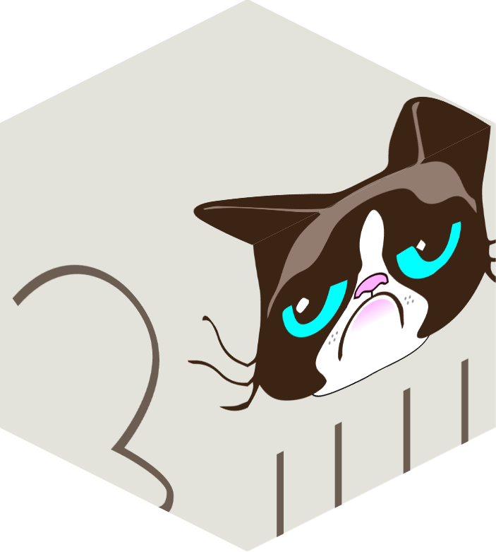

gen-svg-cube

This package makes isometric cubes. It takes in svg's and renders them from a given side at a given resolution.

# Quickstart
TODO

# Screenshots
## Input:
</img>

## Output:
</img>

## GUI
</img>

# Installation
`npm i`

# Usage
From the command line:

```sh
nde svg2cube-cli.js inputs/panels.svg
```

Or in node:

```js
var svg2cube = require('./svg2cube.js');
svg2cube('inputs/panels.svg',{rotateY: 45, size:256});
```

# Author
wassname.org

# License
MIT
